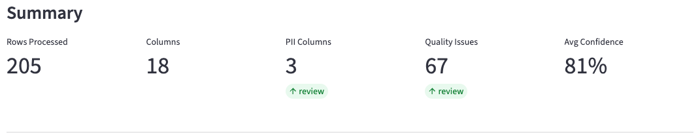
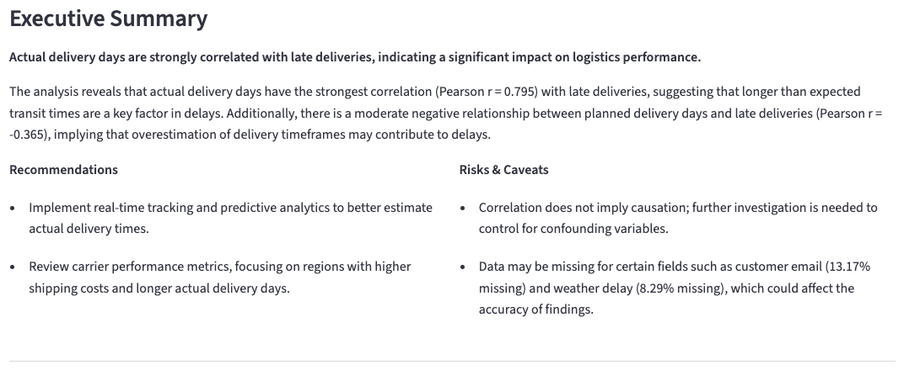
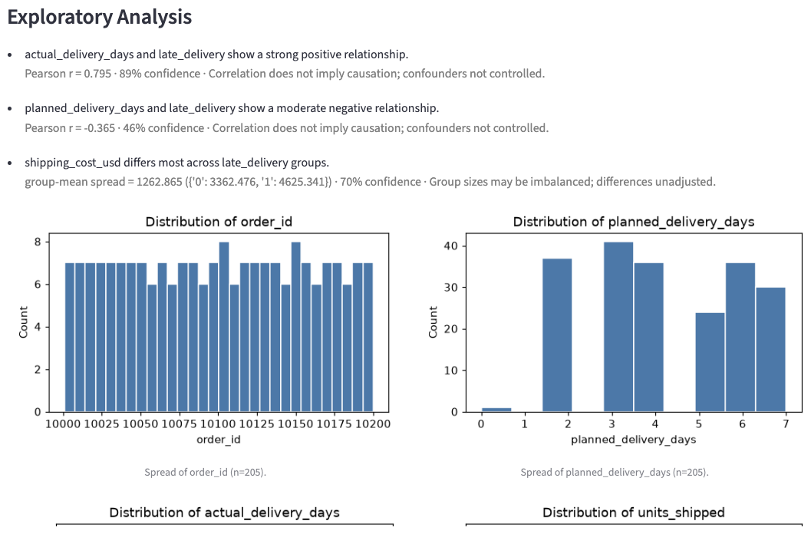
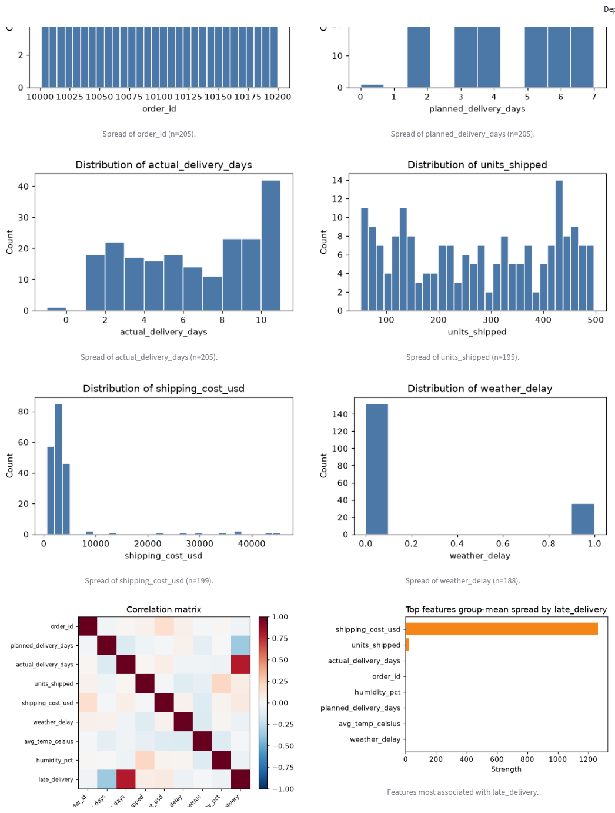
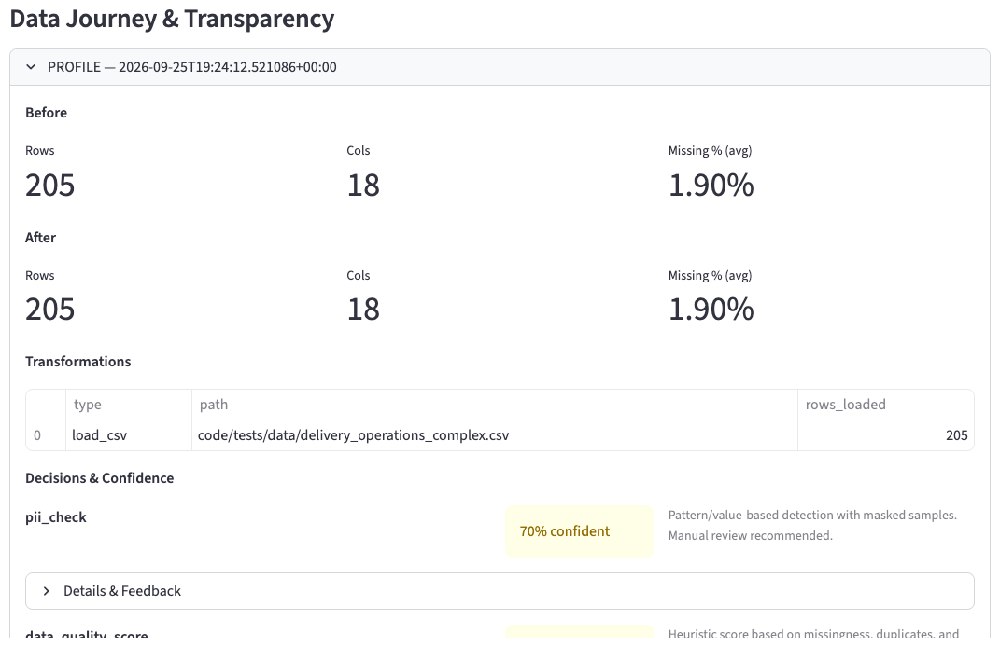
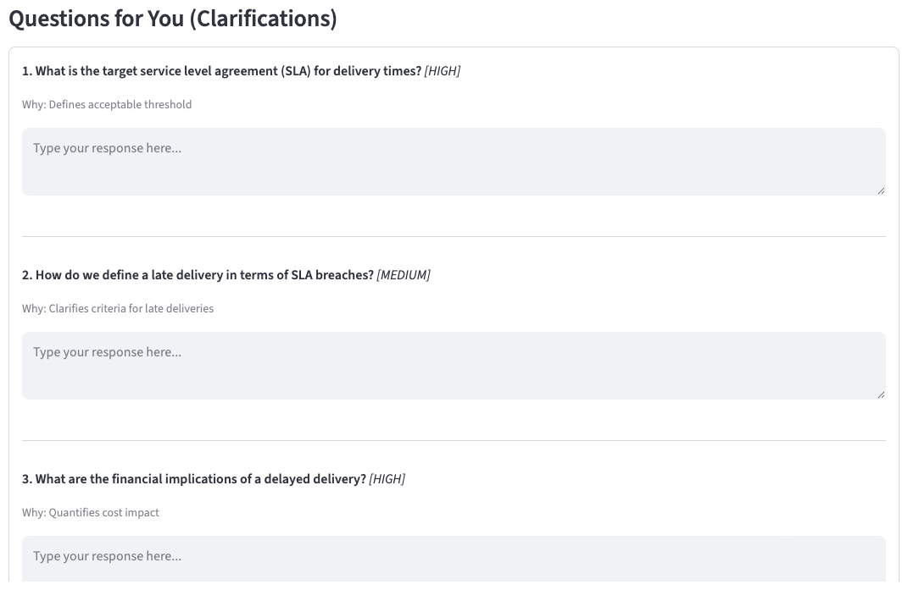

# DataAnalystAgentFramework

[](https://github.com/kushalhebbar/DataAnalystAgentFramework/actions/workflows/ci.yml)

Autonomous data analysis agent that mimics a senior analyst's workflow: it profiles a dataset, asks clarifying questions, runs exploratory analysis, and writes an evidence-grounded summary — recording the reasoning and confidence behind every step.

## Live Demo

[](https://share.streamlit.io/deploy?repository=kushalhebbar/DataAnalystAgentFramework&branch=main&mainModule=code/app/streamlit_app.py)

The app deploys to [Streamlit Community Cloud](https://streamlit.io/cloud) and runs a **zero-secret demo mode** out of the box: data profiling, target detection, EDA charts, and full lineage all work without any API key. To enable the LLM-generated clarification questions and narrative summary, add a provider secret (see below).

**Deploy it yourself:**
1. Fork this repo, then open the **Open in Streamlit** button above (or go to [share.streamlit.io](https://share.streamlit.io), pick the repo, and set the main file to `code/app/streamlit_app.py`).
2. In the app's **Secrets** box, paste one of the configs from [.streamlit/secrets.toml.example](.streamlit/secrets.toml.example):
   - `LLM_PROVIDER = "none"` — zero-secret demo (heuristic fallbacks for LLM steps)
   - `LLM_PROVIDER = "openai"` + `OPENAI_API_KEY` — full features
3. Deploy. First load builds the environment; subsequent runs are fast.

## Screenshots

**Structured intake** — captures the problem, audience, goal, and success metric before touching the data.


**Summary dashboard** — rows, columns, PII columns, quality issues, and average decision confidence at a glance.



**Executive summary** — an evidence-grounded narrative with recommendations and risks, written for the stated audience.



**Exploratory analysis** — automated findings citing the actual correlations and confidence behind each claim.



**Generated charts** — distributions, a correlation matrix, and target-relationship rankings produced per run.



**Data journey & lineage** — a full before/after record with transformations and confidence for every node.



**Clarification questions** — prioritized questions the agent asks before drawing firm conclusions.




## Quick Start

```bash
# Install dependencies
poetry install

# Start Ollama and pull model
ollama pull qwen2.5:14b

# Run Streamlit app
poetry run streamlit run code/app/streamlit_app.py

# Run with test config (auto-populate fields)
TEST_CONFIG=code/tests/test_config.json poetry run streamlit run code/app/streamlit_app.py
```

---

## Setup

### Dependencies (Poetry)
```bash
poetry install        # Install all dependencies
poetry add <package>  # Add new dependency
```

**Core**: numpy, pandas, pyarrow, pydantic, scikit-learn, streamlit  
**Agent**: langgraph, langchain, langchain-ollama

### LLM (pluggable)
```bash
# Default: local Ollama
ollama pull qwen2.5:14b   # Download model (strong JSON / instruction following)
ollama serve              # Start server (default: http://localhost:11434)

# Optional: hosted providers (no code changes)
export LLM_PROVIDER=openai      # or: anthropic
export LLM_MODEL=gpt-4o-mini     # provider-specific model id
# provider API key via the usual env var, e.g. OPENAI_API_KEY / ANTHROPIC_API_KEY
```

---

## Run Commands

| Command | Description |
|---------|-------------|
| `poetry run streamlit run code/app/streamlit_app.py` | Start the Streamlit UI |
| `poetry run pytest` | Run the unit tests |
| `poetry run python code/tests/test_runner.py` | Full-pipeline integration run (needs Ollama) |

---

## Project Structure

```
code/
├── app/
│   └── streamlit_app.py      # UI: upload, inputs, graph invocation, results, exports
├── src/
│   ├── state.py              # Pydantic models: RunState, Profile, EDAResult, Insights
│   ├── graph.py              # LangGraph: build_graph() wires the five nodes
│   ├── llm.py                # get_llm() — Ollama / OpenAI / Anthropic via LLM_PROVIDER
│   ├── tools.py              # Data utils: profiling, correlations, quality + PII checks
│   ├── report.py             # PDF (reportlab) and PPTX (python-pptx) export
│   ├── logging_config.py     # setup_logging()
│   └── nodes/
│       ├── profile.py        # Profiling, quality scoring, PII detection
│       ├── target.py         # Candidate target-column scoring
│       ├── intake.py         # LLM clarification questions
│       ├── eda.py            # Correlations, charts, findings
│       └── insights.py       # LLM evidence-grounded summary
└── tests/
    ├── test_tools.py         # Unit tests: profiling / correlations / quality / PII
    ├── test_target.py        # Unit tests: target-detection heuristics
    ├── test_llm_and_insights.py  # Unit tests: provider selection, coercion helpers
    ├── test_runner.py        # Full-pipeline integration runner
    ├── test_config.json      # Stress test (205 rows, data quality issues)
    ├── test_config_baseline.json   # Baseline (10 rows, clean)
    ├── test_config_exploratory.json # No target specified
    └── data/
        ├── delivery_operations.csv
        ├── delivery_operations_complex.csv
        └── delivery_operations_complex.py
```

**Other folders:**
- `artifacts/<run_id>/` — Pipeline outputs (state.json, explainability.log, charts, reports)
- `logs/` — Application logs (one file per node)

---

## Pipeline Flow

```
Profile → Target Detect → Intake → EDA → Insights → END
                                   ↑
                            (Feedback Loop)
```

1. **Profile Node** — Loads CSV, computes stats, detects PII, flags quality issues
2. **Target Detect Node** — Scores candidate target columns if not user-provided
3. **Intake Node** — Calls LLM to generate clarification questions, refines problem statement
4. **EDA Node** — Computes correlations and target relationships, renders charts, extracts findings
5. **Insights Node** — LLM writes an evidence-grounded executive summary (headline, narrative, recommendations, risks)
6. **Feedback Loop** — User answers questions / overrides decisions and re-runs

---

## Testing

### Unit Tests (pytest)
```bash
# Fast, offline unit tests (no LLM required) — run in CI
poetry run pytest
```

Covers profiling, correlation/target analysis, data-quality and PII detection,
target-column heuristics, LLM provider selection, and insight coercion.

### Integration Tests (full pipeline)
```bash
# Runs the three test configs end to end through the graph — requires Ollama running
poetry run python code/tests/test_runner.py
```

### Test Configs
| Config | Dataset | Rows | Purpose |
|--------|---------|------|---------|
| `test_config.json` | Complex | 205 | Stress test (missing, outliers, PII) |
| `test_config_baseline.json` | Clean | 10 | Happy path |
| `test_config_exploratory.json` | Complex | 205 | No target specified |

---

## Key Features

- **Full lineage** — Every transformation tracked with before/after snapshots
- **Decision explanations** — Each decision records a confidence score and a caveat
- **Automated EDA** — Correlations, target relationships, and charts generated per run
- **Evidence-grounded insights** — The LLM summary is constrained to computed numbers, not free invention
- **Report export** — One-click PDF and PowerPoint deliverables
- **Pluggable LLM backend** — Local Ollama by default; switch to OpenAI or Anthropic via `LLM_PROVIDER`
- **PII detection** — Pattern-based detection with masked samples
- **Data quality scoring** — Missing %, duplicates, outliers, impossible values
- **Feedback loop** — Override a decision and re-run the pipeline

---

## Artifacts

Each run produces:
```
artifacts/<run_id>/
├── state.json           # Full RunState (inputs, profile, EDA, insights, lineage)
├── explainability.log   # Human-readable audit log (tree format)
├── charts/              # Generated EDA charts (PNG)
├── report.pdf           # Exported analysis report (on demand)
└── report.pptx          # Exported slide deck (on demand)
```
